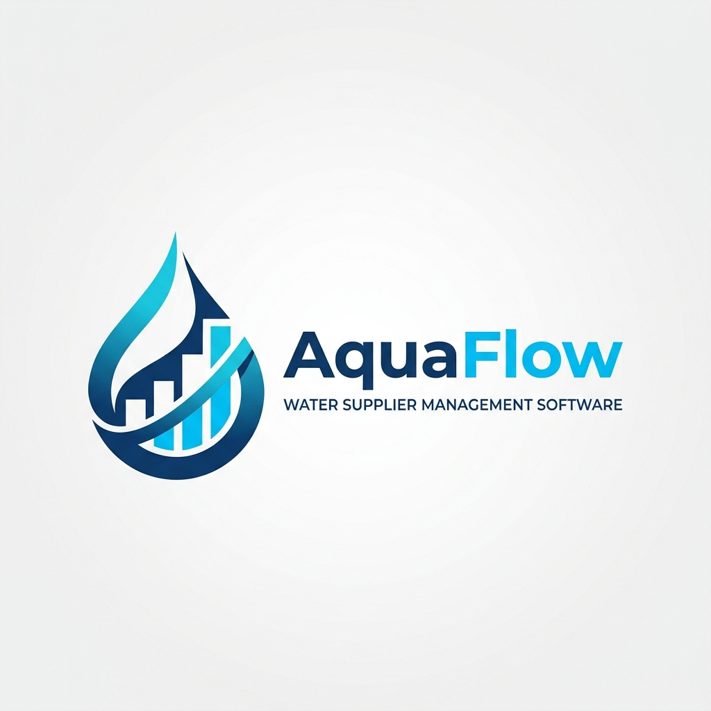

#  AquaFlow
## Water Supplier Management System

[](https://fastapi.tiangolo.com/)
[](https://reactjs.org/)
[](https://www.typescriptlang.org/)
[](https://tailwindcss.com/)
[](https://www.postgresql.org/)

**AquaFlow** is a premium, production-ready SaaS platform designed for bottled water businesses. It streamlines operations by integrating inventory management, CRM, billing, and financial reporting into a unified, high-performance interface.

---

## 🌟 Key Features

### 📊 Intelligence & Analytics
- **Dynamic Dashboard**: Real-time visualization of sales trends, revenue, and active clients using Recharts.
- **Financial Reporting**: Comprehensive accounting logs and PDF report generation for business insights.

### 📦 Operations & Inventory
- **Multi-SKU Management**: Track various bottle sizes and types with automated stock updates.
- **Supplier CRM**: Manage supplier relationships, procurement history, and price variations.
- **Quick Sell**: Optimized mobile-friendly workflow for fast order processing in the field.

### 👥 Client & Billing
- **Client CRM**: 360-degree view of client orders, payment history, and location data.
- **Automated Billing**: Professional PDF invoice generation with automated payment reminders.
- **Event Booking**: Specialized module for managing water supply for premium events and contracts.

### 🛡️ Security & Performance
- **RBAC (Role-Based Access Control)**: Granular permissions for Admin, Manager, and Staff roles.
- **JWT Authentication**: Secure, stateless authentication with high-entropy secret keys.
- **Rate Limiting**: Built-in protection against brute-force and API abuse.

---

## 🏗️ Project Architecture

```text
water-supplier-management/
├── backend/            # FastAPI + SQLAlchemy + PostgreSQL
│   ├── app/            # Core application logic
│   ├── tests/          # Pytest suite
│   └── pyproject.toml  # Dependency management
├── frontend/           # React 19 + Vite + TypeScript
│   ├── src/            # Components, Hooks, and Features
│   └── tailwind.config.js
├── database/           # SQL Migrations and Seed data
└── docs/               # Technical documentation and assets
```

---

## 🚀 Getting Started

### Prerequisites
- Python 3.12+
- Node.js 20+
- PostgreSQL (or Supabase)

### 1. Backend Setup
```bash
cd backend
python -m venv .venv
source .venv/bin/activate  # Windows: .venv\Scripts\activate
pip install -e .
cp .env.example .env       # Update with your DB credentials
uvicorn app.main:app --reload
```

### 2. Frontend Setup
```bash
cd frontend
npm install
cp .env.example .env       # Update API URL
npm run dev
```

### 3. Database Initialization
Run the initialization scripts in the `database/` directory against your PostgreSQL instance to set up the schema and seed demo data.

---

## 🛠️ Technical Highlights

- **Type Safety**: End-to-end type safety with Pydantic (Backend) and TypeScript/Zod (Frontend).
- **Asynchronous IO**: Fully async backend leveraging `asyncpg` and SQLAlchemy 2.0 for maximum concurrency.
- **Premium UI**: Crafted with Tailwind CSS and Framer Motion for smooth, interactive experiences.
- **Search**: Global search functionality across products, clients, and invoices.

---

## 📜 Documentation

For a deep dive into the project structure, API endpoints, and internal logic, please refer to the [**Detailed Walkthrough**](docs/WALKTHROUGH.md).

---

## 🤝 Contributing

Contributions are welcome! Please read our [Contribution Guidelines](docs/CONTRIBUTING.md) for details on our code of conduct and the process for submitting pull requests.

---

Developed with ❤️ by the AquaFlow Team.
